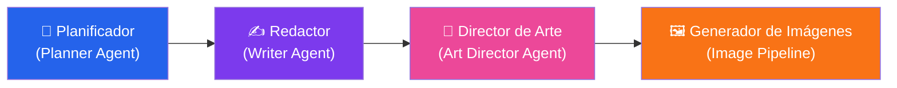
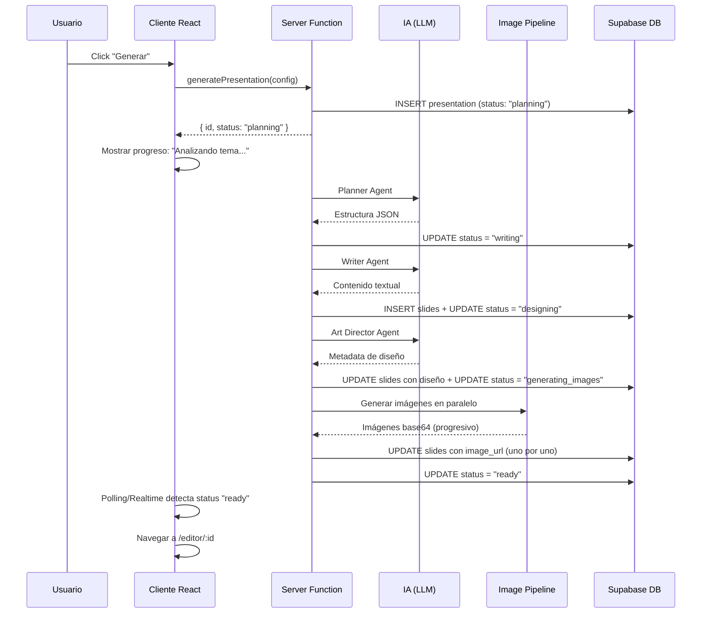
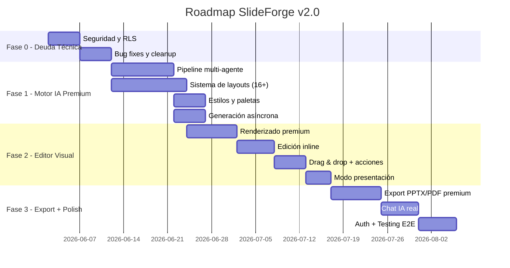

# PRD — SlideForge: Plataforma de Diapositivas Premium con IA

**Versión:** 1.0  
**Fecha:** 28 de Mayo de 2026  
**Autor:** Technical Lead & Product Manager  
**Estado:** 📋 En Revisión — Pendiente de Aprobación del Stakeholder  

---

## Tabla de Contenidos

1. [Visión del Producto](#1-visión-del-producto)
2. [Contexto y Origen del Proyecto](#2-contexto-y-origen-del-proyecto)
3. [Diagnóstico Técnico del Estado Actual](#3-diagnóstico-técnico-del-estado-actual)
4. [Definición del Problema](#4-definición-del-problema)
5. [Usuarios Objetivo](#5-usuarios-objetivo)
6. [Épicas e Historias de Usuario](#6-épicas-e-historias-de-usuario)
7. [Requerimientos Funcionales (RF)](#7-requerimientos-funcionales-rf)
8. [Requerimientos No Funcionales (RNF)](#8-requerimientos-no-funcionales-rnf)
9. [Sistema de Diseño Premium](#9-sistema-de-diseño-premium)
10. [Arquitectura del Motor de IA](#10-arquitectura-del-motor-de-ia)
11. [Formato JSON Extendido — Especificación de Slide](#11-formato-json-extendido--especificación-de-slide)
12. [Roadmap de Implementación](#12-roadmap-de-implementación)
13. [Métricas de Éxito (KPIs)](#13-métricas-de-éxito-kpis)
14. [Análisis de Infraestructura y Despliegue](#14-análisis-de-infraestructura-y-despliegue)

---

## 1. Visión del Producto

**SlideForge** es una plataforma web impulsada por inteligencia artificial que genera presentaciones visualmente espectaculares, modernas y creativas — al nivel de un director de arte senior de una agencia premium.

> **Declaración de Visión:**  
> *"Cualquier persona, sin conocimientos de diseño, debe poder generar una presentación que parezca hecha por el equipo creativo de Apple, Stripe o Vercel. La IA actúa como un director de arte, un diseñador editorial y un storyteller visual — no como un generador básico de PowerPoint."*

### Principios Rectores

| Principio | Significado |
|---|---|
| **Calidad visual > cantidad** | Cada slide debe sentirse diseñada a mano por un profesional |
| **Variación obligatoria** | Ninguna diapositiva debe parecerse a otra dentro de la misma presentación |
| **Contenido integrado** | Todo el texto vive DENTRO de la slide, nunca en formularios externos |
| **Relevancia temática** | Las imágenes deben tener relación directa y verificable con el tema |
| **Storytelling visual** | La presentación cuenta una historia — no es una lista de datos |
| **Edición como Canva** | El editor debe sentirse como una herramienta de diseño, no como un CRUD |

### Inspiraciones de Producto

| Categoría | Referencias |
|---|---|
| **Plataformas de presentaciones** | Gamma.app, Pitch.com, Beautiful.ai, Tome.app, Canva Presentations |
| **Estética de producto** | Apple Keynote, Stripe, Linear, Notion, Arc Browser, Vercel |
| **Diseño editorial** | Behance, Dribbble, Awwwards, Lapa.ninja |
| **Generación de IA** | Midjourney (estética), Runway (cinematografía), Figma AI |

---

## 2. Contexto y Origen del Proyecto

### Cómo se creó

El proyecto actual fue generado íntegramente con la IA de **[Lovable.dev](https://lovable.dev/)**, una plataforma de desarrollo asistido por IA que produce aplicaciones full-stack con TanStack Start, Supabase y shadcn/ui.

### Stack tecnológico heredado

| Capa | Tecnología | Versión |
|---|---|---|
| **Meta-framework** | TanStack Start (SSR sobre Vite + Nitro) | Router v1.168, Start v1.167 |
| **UI** | React 19 + shadcn/ui (New York variant) + Tailwind CSS v4 | React 19.2, Tailwind 4.2 |
| **Base de datos** | Supabase (PostgreSQL + Storage + Auth) | SDK v2.106 |
| **IA** | Lovable AI Gateway → Gemini 3 Flash (texto), GPT Image 2 / Gemini 2.5 Flash (imágenes) | — |
| **Export** | pptxgenjs (PPTX) + jspdf (PDF) | pptx 4.0, jspdf 4.2 |
| **Animaciones** | Framer Motion | v12.40 |
| **Hosting actual** | Lovable.dev (preview/deploy integrado) | — |

### Implicaciones de Lovable.dev

> [!IMPORTANT]
> El código fue generado por IA y tiene limitaciones estructurales significativas. La calidad del scaffold es buena para un MVP, pero presenta deuda técnica que debe resolverse antes de escalar funcionalidades de IA avanzadas.

1. **Componentes UI generosos:** 46 componentes shadcn/ui instalados, muchos sin uso actual (calendar, chart, carousel, menubar, etc.) — sobredimensionado.
2. **Seguridad sacrificada por velocidad:** La migración #3 eliminó toda seguridad (RLS, FK constraints, auth) para facilitar el "modo personal sin login".
3. **Patrones de código correcto pero incompleto:** El middleware de autenticación fue generado pero nunca conectado a las funciones de servidor.
4. **Dependencia del Lovable AI Gateway:** Las funciones de IA dependen de `https://ai.gateway.lovable.dev/v1` y la variable `LOVABLE_API_KEY` — lo cual acopla el proyecto a Lovable.

---

## 3. Diagnóstico Técnico del Estado Actual

### 3.1 Problemas Críticos (Severidad Alta 🔴)

#### SEC-01: Seguridad — RLS completamente deshabilitado
- **Archivo:** Migración `20260527192448_837e01a3.sql`
- **Problema:** Todas las políticas RLS fueron reemplazadas por `USING (true) WITH CHECK (true)`. Permisos de CRUD otorgados al rol `anon`. Cualquier persona puede leer, modificar o borrar datos de cualquier usuario.
- **Impacto:** Imposible llevar a producción multi-usuario.

#### SEC-02: Funciones del servidor sin autenticación
- **Archivos:** `presentations.functions.ts`, `references.functions.ts`, `settings.functions.ts`
- **Problema:** Todas las Server Functions usan `supabaseAdmin` (service role key, bypasea RLS). Nunca filtran por `user_id`. El middleware `requireSupabaseAuth` existe pero no está conectado.
- **Impacto:** Incluso con RLS activo en la BD, el código de la API lo ignoraría.

#### BUG-01: Estado stale en el editor de diapositivas
- **Archivo:** `editor.$id.tsx` — componentes `EditableField` y `EditableList`
- **Problema:** `useState(value)` inicializa el estado desde props solo una vez. Al cambiar de slide, los campos muestran el contenido de la slide anterior.
- **Fix:** Agregar `key={slide.id}` al componente para forzar remontaje.

---

### 3.2 Problemas Medios (Severidad Media 🟡)

| ID | Área | Problema | Archivo(s) |
|---|---|---|---|
| PERF-01 | Performance | Conversión base64 carácter por carácter — O(n²) para archivos grandes | `_app.new.tsx`, `ai.server.ts` |
| PERF-02 | Performance | `generatePresentation` bloquea el request HTTP durante toda la generación de IA + imágenes (puede ser >60s) | `presentations.functions.ts` |
| ARCH-01 | Arquitectura | Violación DRY: formularios de configuración duplicados entre `_app.new.tsx` y `_app.settings.tsx` | Ambos archivos |
| ARCH-02 | Arquitectura | CSS inline (`<style>`) duplicado en componentes de ruta | `_app.new.tsx`, `_app.settings.tsx` |
| ARCH-03 | Arquitectura | `queryOptions` definido dos veces (loader y componente) en el editor | `editor.$id.tsx` |
| DATA-01 | Integridad | `deletePresentation` no elimina archivos del Storage de Supabase | `presentations.functions.ts` |
| DATA-02 | Integridad | `deleteReference` no elimina archivos del Storage | `references.functions.ts` |
| DATA-03 | Integridad | Sin constraint `UNIQUE(presentation_id, position)` en slides — posiciones duplicadas | Migración #1 |
| NET-01 | Resiliencia | Sin `AbortController` ni timeout en llamadas al AI Gateway — requests pueden colgar indefinidamente | `ai.server.ts` |
| UX-01 | UX | Sidebar no responsive — `w-64` fijo sin collapse en mobile | `AppSidebar.tsx` |
| UX-02 | UX | Chat "falso" — el asistente siempre responde con el mismo mensaje predefinido | `_app.new.tsx` |
| I18N-01 | Consistencia | Error page en inglés, resto de la app en español | `error-page.ts` |

---

### 3.3 Aspectos Positivos ✅

| Área | Detalle |
|---|---|
| **SSR correcto** | Patrón `ensureQueryData` en loaders + `useSuspenseQuery` en componentes — elimina layout shifts |
| **Error handling robusto** | 3 capas de protección: error boundary (client), middleware (server fns), server.ts (SSR) |
| **Proxy lazy para Supabase** | Clientes inicializados bajo demanda — compatible con SSR y Cloudflare Workers |
| **Validación con Zod** | Inputs de Server Functions validados con schemas tipados |
| **Design System coherente** | Variables CSS oklch + shadcn/ui + glassmorphism bien implementados |
| **Factory pattern para Router** | `getRouter()` crea instancias frescas por request — correcto para SSR |

---

## 4. Definición del Problema

### Problemas que experimenta el usuario actualmente

```
┌──────────────────────────────────────────────────────────────────┐
│  "Las diapositivas se ven como PowerPoint de 2010."             │
│  "Todas las slides son iguales — mismo layout repetido."        │
│  "Las imágenes no tienen NADA que ver con el tema."             │
│  "Los textos aparecen debajo de la slide en inputs feos."       │
│  "No hay creatividad visual — es aburrido."                     │
│  "Las paletas tienen nombres en inglés sin significado visual." │
│  "El editor es un formulario, no una herramienta de diseño."    │
└──────────────────────────────────────────────────────────────────┘
```

### Causa raíz técnica

1. **Motor de IA simplista:** El prompt del sistema actual genera un JSON plano con solo 8 layouts posibles. No hay instrucciones de composición visual, jerarquía, ni storytelling.
2. **Renderizado como formulario:** El editor muestra inputs de texto debajo de un preview estático, en lugar de renderizar la slide como un canvas editable.
3. **Imágenes genéricas:** Los `image_prompt` generados por la IA no incluyen directivas de estilo cinematográfico, color grading, ni relevancia temática forzada.
4. **Sin variación de layout:** La IA repite los mismos 2-3 layouts porque el prompt no exige diversidad.
5. **Paletas limitadas:** Solo 5 paletas hardcodeadas con nombres en inglés.

---

## 5. Usuarios Objetivo

### Persona Principal: "El Profesional Creativo"

| Atributo | Detalle |
|---|---|
| **Perfil** | Freelancer, emprendedor, profesional de marketing, profesor universitario, consultor |
| **Necesidad** | Crear presentaciones visualmente impactantes sin saber diseño |
| **Frustración** | PowerPoint es feo, Canva toma mucho tiempo, Gamma es limitado en personalización |
| **Expectativa** | Describir su idea en texto y obtener slides de calidad de agencia en minutos |
| **Idioma** | Español (principal), inglés (secundario) |
| **Dispositivo** | Desktop (principal), tablet (secundario) |

### Persona Secundaria: "El Estudiante Moderno"

| Atributo | Detalle |
|---|---|
| **Perfil** | Estudiante universitario, investigador junior |
| **Necesidad** | Presentaciones académicas que no se vean aburridas |
| **Frustración** | Los templates gratuitos son genéricos; no tiene presupuesto para herramientas premium |
| **Expectativa** | Estilo "Académico Moderno" con estructura clara pero visualmente elegante |

---

## 6. Épicas e Historias de Usuario

### Épica 1: Motor de Generación Premium con IA 🧠

| ID | Historia de Usuario | Prioridad | Criterios de Aceptación |
|---|---|---|---|
| US-101 | Como usuario, quiero describir mi tema en lenguaje natural y que la IA genere una presentación visualmente espectacular con layouts variados. | P0 | Cada slide usa un layout diferente. Mínimo 12 layouts distintos disponibles. |
| US-102 | Como usuario, quiero que las imágenes generadas tengan relación directa y verificable con el tema de mi presentación. | P0 | El prompt de imagen incluye el contexto temático + directivas de estilo cinematográfico. Imágenes irrelevantes = 0. |
| US-103 | Como usuario, quiero elegir el número de slides manualmente (3-30) o dejar que la IA decida automáticamente ("AUTO"). | P0 | Modo AUTO distribuye contenido según complejidad y ritmo visual. |
| US-104 | Como usuario, quiero que la IA actúe como un director de arte, decidiendo composición, peso visual, espaciado y alineación de cada slide. | P0 | El JSON generado incluye metadata de diseño (`spacing`, `alignment`, `visualWeight`, `composition`). |
| US-105 | Como usuario, quiero que el contenido textual sea conciso (3-5 bullets máximo) y que la IA resuma inteligentemente. | P1 | Ninguna slide tiene más de 5 bullets. Frases ≤15 palabras. |
| US-106 | Como usuario, quiero poder adjuntar documentos de referencia (PDF, texto, imágenes) y que la IA los use como contexto para generar slides relevantes. | P1 | El contenido de los documentos influye directamente en los textos y la estructura generada. |
| US-107 | Como usuario, quiero un chat conversacional real donde pueda refinar mi presentación iterativamente antes de generarla. | P2 | El asistente responde con sugerencias reales basadas en IA (no mensajes predefinidos). |

---

### Épica 2: Sistema de Diseño y Estilos Visuales 🎨

| ID | Historia de Usuario | Prioridad | Criterios de Aceptación |
|---|---|---|---|
| US-201 | Como usuario, quiero elegir entre 7 estilos visuales: Minimalista, Corporativo Premium, Creativo, Editorial, Cinematográfico, Tecnológico, Académico Moderno. | P0 | Cada estilo produce slides con estética coherente y radicalmente diferente entre sí. |
| US-202 | Como usuario, quiero paletas de colores con nombres en español descriptivos y visuales (ej: "Azul Eléctrico y Grafito"). | P0 | Mínimo 15 paletas predefinidas. Cada una con nombre, 4+ colores HEX, propósito visual y emoción transmitida. |
| US-203 | Como usuario, quiero que la IA pueda generar paletas personalizadas automáticamente basadas en el tema. | P1 | Si selecciono "Auto-paleta", la IA genera una paleta coherente con el tema y el estilo visual. |
| US-204 | Como usuario, quiero combinaciones tipográficas premium automáticas (título/cuerpo) según el estilo visual elegido. | P0 | Fuentes de Google Fonts o Fontshare. Cada estilo tiene 2-3 pares tipográficos asignados. |
| US-205 | Como usuario, quiero elegir el nivel cinematográfico de las imágenes (bajo, medio, alto, ultra). | P2 | El nivel afecta los prompts de imagen: iluminación, profundidad de campo, color grading. |

---

### Épica 3: Editor de Diapositivas Visual (Tipo Canva) ✏️

| ID | Historia de Usuario | Prioridad | Criterios de Aceptación |
|---|---|---|---|
| US-301 | Como usuario, quiero que TODO el contenido se renderice DENTRO de la slide como diseño final — no en inputs externos. | P0 | No existen campos de formulario debajo/al lado de la slide. El texto es parte del canvas. |
| US-302 | Como usuario, quiero editar texto haciendo click directo sobre la slide (inline editing). | P0 | Click sobre título/subtítulo/bullet → se activa modo edición inline. Blur o Enter → guarda. |
| US-303 | Como usuario, quiero regenerar la imagen de una slide individual con un click. | P0 | Botón de regeneración visible en hover sobre la imagen. Muestra spinner durante generación. |
| US-304 | Como usuario, quiero poder reordenar slides mediante drag and drop. | P1 | Arrastrar slide en el panel lateral cambia su posición. Persiste en la BD. |
| US-305 | Como usuario, quiero poder cambiar el layout de una slide individual sin regenerar todo. | P1 | Selector de layout por slide con preview en miniatura de cada opción. |
| US-306 | Como usuario, quiero poder duplicar y eliminar slides individuales. | P1 | Botones contextuales en cada slide. |
| US-307 | Como usuario, quiero ver una barra de herramientas contextual al seleccionar elementos (cambiar fuente, tamaño, color, alineación). | P2 | Toolbar flotante aparece sobre el elemento seleccionado. |
| US-308 | Como usuario, quiero un modo presentación fullscreen para previsualizar las slides. | P1 | Teclas de flecha para navegar. Transiciones suaves entre slides. |

---

### Épica 4: Exportación Premium 📤

| ID | Historia de Usuario | Prioridad | Criterios de Aceptación |
|---|---|---|---|
| US-401 | Como usuario, quiero exportar a PPTX con layouts, colores, tipografías e imágenes embebidas tal como se ven en el editor. | P0 | El archivo PPTX refleja fielmente el diseño del editor. Imágenes embebidas, no enlaces. |
| US-402 | Como usuario, quiero exportar a PDF de alta calidad con composiciones fieles al diseño. | P0 | PDF en landscape con todos los elementos visuales correctos. |
| US-403 | Como usuario, quiero exportar slides individuales como imágenes PNG. | P2 | Click derecho → "Exportar como imagen". Resolución 1920x1080 mínimo. |
| US-404 | Como usuario, quiero un link compartible para presentaciones online. | P3 | URL pública con las slides renderizadas en modo presentación. |

---

### Épica 5: Seguridad y Multi-tenancy 🔒

| ID | Historia de Usuario | Prioridad | Criterios de Aceptación |
|---|---|---|---|
| US-501 | Como usuario, quiero que mis presentaciones sean privadas y solo yo pueda verlas/editarlas. | P0 | RLS activo. Todas las queries filtran por `user_id`. |
| US-502 | Como usuario, quiero poder registrarme e iniciar sesión con email/contraseña o Google OAuth. | P0 | Flujo de auth completo con Supabase Auth. |
| US-503 | Como usuario, quiero un perfil donde pueda ver mi historial y ajustes predeterminados. | P1 | Página de perfil con datos de cuenta y settings. |

---

### Épica 6: UX y Responsive 📱

| ID | Historia de Usuario | Prioridad | Criterios de Aceptación |
|---|---|---|---|
| US-601 | Como usuario, quiero que la aplicación funcione correctamente en desktop (1024px+). | P0 | Layout sidebar + main content optimizado para 1024-1920px. |
| US-602 | Como usuario, quiero que la sidebar colapse en un hamburger menu en pantallas <768px. | P1 | Menu hamburger con overlay. El hook `useIsMobile` se conecta al `AppSidebar`. |
| US-603 | Como usuario, quiero feedback visual claro durante la generación de la presentación (progreso por etapas). | P0 | Barra de progreso con pasos: "Analizando tema" → "Estructurando slides" → "Generando imágenes" → "Listo". |

---

## 7. Requerimientos Funcionales (RF)

### RF-01: Motor de Generación de Slides con IA

| Sub-req | Descripción |
|---|---|
| RF-01.1 | El sistema debe generar una presentación completa (estructura + textos + imágenes) a partir de un prompt en lenguaje natural. |
| RF-01.2 | El pipeline de IA debe seguir una arquitectura multi-agente: Planificador → Redactor → Director de Arte → Generador de Imágenes. |
| RF-01.3 | Cada slide generada debe usar un layout diferente. El sistema debe disponer de mínimo 16 layouts: `hero_minimal`, `split_left`, `split_right`, `image_cards`, `timeline`, `dashboard`, `quote`, `infographic`, `bento_grid`, `collage_editorial`, `comparison`, `metric_blocks`, `floating_image`, `asymmetric`, `cinematic`, `visual_storytelling`. |
| RF-01.4 | Los prompts de imagen deben incluir: tema contextual, estilo cinematográfico, iluminación, composición, color grading acorde a la paleta seleccionada. |
| RF-01.5 | La generación de imágenes debe ejecutarse de forma asíncrona (no bloquear el HTTP request). El cliente recibirá actualizaciones de progreso. |
| RF-01.6 | Modo "AUTO" de slide count: la IA decide cuántas slides necesita basándose en la cantidad de información, complejidad del tema y ritmo de storytelling. |

### RF-02: Configuración de Generación

| Sub-req | Descripción |
|---|---|
| RF-02.1 | El usuario puede configurar: `purpose` (propósito), `visualStyle` (estilo visual), `palette` (paleta), `typography` (par tipográfico), `tone` (tono), `language` (idioma), `slideCount` (cantidad o AUTO), `density` (densidad de contenido), `aspectRatio` (16:9, 4:3), `imageMode` (IA, web, mixto, sin imágenes), `cinematicLevel` (bajo, medio, alto, ultra). |
| RF-02.2 | Los valores por defecto del usuario se persisten en `user_settings` y se pre-populan en nuevas generaciones. |

### RF-03: Editor Visual de Slides

| Sub-req | Descripción |
|---|---|
| RF-03.1 | Las slides se renderizan como componentes React estilizados con CSS, no como imágenes estáticas. |
| RF-03.2 | Cada layout tiene un componente de renderizado dedicado que aplica composición, tipografía, colores y posicionamiento de imagen según la especificación JSON. |
| RF-03.3 | La edición de texto es inline (contentEditable o input overlay sobre la slide). |
| RF-03.4 | Las imágenes pueden regenerarse individualmente con prompt personalizable. |
| RF-03.5 | Las slides pueden reordenarse, duplicarse y eliminarse. |

### RF-04: Paletas y Tipografías

| Sub-req | Descripción |
|---|---|
| RF-04.1 | El sistema ofrece mínimo 15 paletas predefinidas con nombres en español. |
| RF-04.2 | Cada paleta define: `nombre`, `colores` (array de 4-6 HEX), `propósito` (descripción), `emoción` (tag emocional). |
| RF-04.3 | La IA puede generar paletas dinámicas basadas en el tema del usuario. |
| RF-04.4 | Pares tipográficos servidos desde Google Fonts o Fontshare, agrupados por estilo visual. |

### RF-05: Exportación

| Sub-req | Descripción |
|---|---|
| RF-05.1 | Exportar a PPTX con layouts, colores, tipografías e imágenes embebidas. |
| RF-05.2 | Exportar a PDF en alta resolución landscape. |
| RF-05.3 | Sanitizar el título de la presentación antes de usarlo como nombre de archivo. |

### RF-06: Gestión de Referencias

| Sub-req | Descripción |
|---|---|
| RF-06.1 | El usuario puede subir PDFs, imágenes, y archivos de texto como contexto para la IA. |
| RF-06.2 | Límite de archivo: 10 MB por archivo individual. |
| RF-06.3 | El sistema auto-resume el contenido de las referencias subidas. |
| RF-06.4 | Al eliminar una referencia, el archivo asociado en Storage se elimina también. |

---

## 8. Requerimientos No Funcionales (RNF)

| ID | Categoría | Requerimiento | Métrica |
|---|---|---|---|
| RNF-01 | **Performance** | La generación de la estructura JSON (sin imágenes) debe completarse en <15 segundos. | p95 < 15s |
| RNF-02 | **Performance** | La primera carga de la aplicación (SSR) debe ser <2 segundos en conexión 4G. | LCP < 2s |
| RNF-03 | **Performance** | La exportación a PPTX/PDF debe completarse en <10 segundos para 15 slides. | p95 < 10s |
| RNF-04 | **Disponibilidad** | El servicio debe tener un uptime del 99.5% mensual. | SLA 99.5% |
| RNF-05 | **Seguridad** | Todas las operaciones de base de datos deben validar la identidad del usuario (JWT + RLS). | 0 endpoints sin auth |
| RNF-06 | **Seguridad** | Las claves de API (Lovable, Supabase service role) nunca deben exponerse al cliente. | Audit pass |
| RNF-07 | **Seguridad** | Archivos de usuario almacenados en Storage deben ser accesibles solo por su propietario (excepto thumbnails públicas de slides compartidas). | RLS en Storage |
| RNF-08 | **Escalabilidad** | El sistema debe soportar generación concurrente de al menos 10 presentaciones simultáneas sin degradación. | Load test pass |
| RNF-09 | **Resiliencia** | Las llamadas a APIs externas de IA deben tener timeout de 30 segundos y reintentos (máx. 2). | AbortController + retry |
| RNF-10 | **Accesibilidad** | Contraste de texto WCAG AA (4.5:1 mínimo). Navegación por teclado en el editor. | Lighthouse ≥ 90 |
| RNF-11 | **Internacionalización** | La UI completa debe estar en español. Error pages incluidas. | 0 textos en inglés |
| RNF-12 | **Compatibilidad** | Soporte para Chrome, Firefox, Safari, Edge (últimas 2 versiones). | Cross-browser test pass |

---

## 9. Sistema de Diseño Premium

### 9.1 Estilos Visuales Disponibles

| Estilo | Descripción | Colores Dominantes | Tipografía Sugerida |
|---|---|---|---|
| **Minimalista** | Blanco, negro, gris suave. Mucho espacio negativo. Tipografía limpia. | `#ffffff`, `#0a0a0a`, `#f5f5f5` | Inter + DM Sans |
| **Corporativo Premium** | Navy, grafito, glassmorphism. Dashboards elegantes. | `#0f172a`, `#1e293b`, `#3b82f6` | Manrope + Inter |
| **Creativo** | Gradientes vibrantes, glow, composiciones atrevidas. | Gradientes dinámicos | Clash Display + General Sans |
| **Editorial** | Diseño revista. Tipografías serif elegantes. Layouts sofisticados. | `#1a1a1a`, `#f8f5f0`, `#c6a15b` | Playfair Display + Plus Jakarta Sans |
| **Cinematográfico** | Iluminación dramática. Imágenes full-bleed. Composiciones impactantes. | `#050505`, `#111827`, `#f9fafb` | DM Serif Display + Manrope |
| **Tecnológico** | Estética SaaS. UI cards. Grids. Dark mode. | `#09090b`, `#18181b`, `#6366f1` | Satoshi + Inter |
| **Académico Moderno** | Profesional, limpio, visual. Educativo pero elegante. | `#1e293b`, `#f8fafc`, `#0ea5e9` | Cormorant Garamond + General Sans |

### 9.2 Paletas de Colores Predefinidas

| # | Nombre | Colores | Propósito | Emoción |
|---|---|---|---|---|
| 1 | **Azul Eléctrico y Grafito** | `#2563eb` `#0f172a` `#1e293b` `#dbeafe` | Tecnología, SaaS, startups | Confianza, innovación |
| 2 | **Marfil y Oro Elegante** | `#f8f5f0` `#c6a15b` `#2d2d2d` `#efe6d8` | Lujo, editorial, moda | Sofisticación, elegancia |
| 3 | **Negro Cinematográfico** | `#050505` `#111827` `#374151` `#f9fafb` | Cine, fotografía, arte | Drama, impacto |
| 4 | **Violeta Creativo** | `#7c3aed` `#4c1d95` `#ede9fe` `#1f1b2e` | Creatividad, gaming, diseño | Energía, imaginación |
| 5 | **Verde Editorial** | `#064e3b` `#10b981` `#ecfdf5` `#022c22` | Naturaleza, sostenibilidad, salud | Calma, crecimiento |
| 6 | **Coral y Arena** | `#f97316` `#fef3c7` `#1c1917` `#fed7aa` | Gastronomía, viajes, lifestyle | Calidez, cercanía |
| 7 | **Rosa Moderno** | `#ec4899` `#fdf2f8` `#831843` `#fbcfe8` | Branding femenino, belleza, moda | Frescura, modernidad |
| 8 | **Océano Profundo** | `#0c4a6e` `#0284c7` `#e0f2fe` `#082f49` | Ciencia, investigación, marina | Profundidad, conocimiento |
| 9 | **Fuego y Carbón** | `#dc2626` `#1c1917` `#292524` `#fef2f2` | Deportes, urgencia, impacto | Pasión, acción |
| 10 | **Menta Digital** | `#14b8a6` `#042f2e` `#0d9488` `#ccfbf1` | Fintech, salud digital, apps | Frescura, tecnología |
| 11 | **Ámbar y Obsidiana** | `#d97706` `#0c0a09` `#78350f` `#fffbeb` | Arquitectura, historia, premium | Tradición, valor |
| 12 | **Índigo Nocturno** | `#4f46e5` `#1e1b4b` `#312e81` `#e0e7ff` | Espacio, IA, futuro | Misterio, innovación |
| 13 | **Lima y Carbono** | `#84cc16` `#1a2e05` `#365314` `#ecfccb` | Ecología, startups verdes | Energía, naturaleza |
| 14 | **Lavanda Suave** | `#a78bfa` `#2e1065` `#7c3aed` `#f5f3ff` | Bienestar, educación, meditación | Serenidad, creatividad |
| 15 | **Acero y Neón** | `#06b6d4` `#0f172a` `#164e63` `#cffafe` | Cyberpunk, gaming, tech | Futurista, energético |

### 9.3 Pares Tipográficos

| # | Títulos | Cuerpo | Uso Recomendado |
|---|---|---|---|
| 1 | **Inter** (700) | Inter (400) | Minimalista, Tecnológico |
| 2 | **Playfair Display** (700) | Plus Jakarta Sans (400) | Editorial, Corporativo Premium |
| 3 | **DM Serif Display** (400) | Manrope (400) | Cinematográfico, Académico |
| 4 | **Clash Display** (600) | General Sans (400) | Creativo |
| 5 | **Cormorant Garamond** (600) | Inter (400) | Editorial, Académico Moderno |
| 6 | **Cabinet Grotesk** (700) | Satoshi (400) | Creativo, Tecnológico |
| 7 | **Manrope** (800) | Manrope (400) | Corporativo Premium, Minimalista |

> [!NOTE]
> Las fuentes Satoshi, General Sans, Clash Display y Cabinet Grotesk provienen de [Fontshare](https://www.fontshare.com/) (gratuitas para uso comercial). Las demás están disponibles en Google Fonts.

---

## 10. Arquitectura del Motor de IA

### 10.1 Pipeline Multi-Agente

El motor de generación se reestructura como un pipeline de 4 etapas especializadas, cada una con un prompt de sistema optimizado:



#### Etapa 1: Planificador (Planner Agent)
- **Input:** Prompt del usuario + referencias + configuración.
- **Output:** Estructura JSON con: cantidad de slides, título de cada una, tipo de layout asignado, orden narrativo (storytelling arc).
- **Regla clave:** NO puede repetir el mismo layout en slides consecutivas. Debe usar mínimo 5 layouts distintos en una presentación de 8+ slides.

#### Etapa 2: Redactor (Writer Agent)
- **Input:** Estructura del Planificador + referencias + tono/idioma configurado.
- **Output:** Contenido textual de cada slide: headline, subheadline, bullets (máx. 5), quotes, stats, notas del orador.
- **Regla clave:** Frases ≤15 palabras. No saturar. Storytelling visual sobre datos brutos.

#### Etapa 3: Director de Arte (Art Director Agent)
- **Input:** Estructura + contenido + estilo visual + paleta + tipografía.
- **Output:** Metadatos de diseño para cada slide: `background` (color, gradiente o imagen), `spacing`, `alignment`, `visualWeight`, `composition`, `imagePlacement`, `imageStyle`, `overlayType`.
- **Regla clave:** Cada slide debe sentirse única. Variar composiciones: asimétrica, centrada, grid, split, flotante.

#### Etapa 4: Generador de Imágenes (Image Pipeline)
- **Input:** `image.prompt` enriquecido por el Director de Arte + `cinematicLevel`.
- **Output:** Imágenes base64 subidas a Supabase Storage.
- **Regla clave:** El prompt de imagen SIEMPRE incluye: (1) tema contextual, (2) estilo (cinematográfico/editorial/artístico), (3) iluminación, (4) color grading acorde a la paleta, (5) composición (close-up, wide, overhead, etc.).
- **Ejecución:** Asíncrona en paralelo. No bloquea el request HTTP principal.

### 10.2 Prompt Engineering para Imágenes

```
Formato del prompt de imagen generado automáticamente:

"[TEMA CONTEXTUAL]. [ESTILO VISUAL]. 
Iluminación: [cinematográfica/natural/dramática/suave]. 
Profundidad de campo: [shallow/deep]. 
Color grading: [acorde a paleta HEX]. 
Composición: [editorial/simétrica/regla de tercios]. 
Estilo: [fotografía editorial/ilustración premium/3D render/arte conceptual]. 
NO incluir texto ni letras en la imagen. 
Aspecto ratio: 16:9."

Ejemplo para una presentación sobre "Historia de la Música Clásica":
"Orquesta sinfónica en un teatro iluminado con luz dorada. 
Estilo cinematográfico premium tipo A24 documentary. 
Iluminación: dramática lateral con sombras profundas. 
Profundidad de campo: shallow focus en el director. 
Color grading: tonos cálidos dorados y negros profundos #c6a15b #050505. 
Composición: regla de tercios, director a la izquierda. 
Estilo: fotografía editorial de alta resolución. 
NO incluir texto ni letras en la imagen. 
Aspecto ratio: 16:9."
```

### 10.3 Gestión de Proceso Asíncrono



> [!IMPORTANT]
> El cliente usa **polling cada 3 segundos** o **Supabase Realtime** (subscripción al canal `presentations` filtrado por `id`) para detectar cambios de estado. La UI muestra una barra de progreso con las etapas.

---

## 11. Formato JSON Extendido — Especificación de Slide

### Esquema completo que la IA debe generar:

```json
{
  "title": "Historia de la Música Clásica",
  "theme": {
    "purpose": "educativo",
    "visualStyle": "cinematografico",
    "palette": {
      "name": "Marfil y Oro Elegante",
      "colors": ["#f8f5f0", "#c6a15b", "#2d2d2d", "#efe6d8"],
      "purpose": "Lujo, editorial, arte",
      "emotion": "Sofisticación"
    },
    "typography": {
      "headings": "DM Serif Display",
      "body": "Manrope",
      "weights": { "h1": 700, "h2": 600, "body": 400, "caption": 300 }
    },
    "tone": "inspirador",
    "imageStyle": "cinematografico_editorial"
  },
  "slides": [
    {
      "position": 1,
      "title": "El Nacimiento de una Era",
      "layout": "hero_minimal",
      "style": "cinematic_dark",
      "visualPriority": "image_first",
      "background": {
        "type": "gradient",
        "value": "linear-gradient(135deg, #2d2d2d 0%, #050505 100%)"
      },
      "content": {
        "headline": "El Nacimiento de una Era",
        "subheadline": "Cómo la música clásica transformó la cultura occidental",
        "bullets": [],
        "quote": null,
        "stats": null
      },
      "image": {
        "sourceType": "ai_generated",
        "prompt": "Interior majestuoso de una catedral barroca con un órgano de tubos iluminado por luz dorada lateral. Estilo cinematográfico A24. Iluminación: dramática, rayos de sol atravesando vitrales. Profundidad: shallow focus en los tubos del órgano. Color grading: #c6a15b dorados cálidos sobre #2d2d2d sombras. Sin texto.",
        "placement": "full_bleed_with_overlay",
        "size": "large",
        "style": "cinematic_editorial",
        "overlay": "linear-gradient(to top, rgba(0,0,0,0.8) 0%, transparent 60%)"
      },
      "design": {
        "spacing": "generous",
        "alignment": "bottom_left",
        "visualWeight": "image_heavy",
        "composition": "cinematic_hero",
        "textPosition": { "x": "8%", "y": "70%", "maxWidth": "55%" }
      },
      "notes": "Abrir con impacto visual. La imagen establece el tono emocional de toda la presentación."
    }
  ]
}
```

### Layouts Soportados (Mínimo 16)

| Layout ID | Descripción | Proporción Imagen/Texto |
|---|---|---|
| `hero_minimal` | Imagen hero con texto overlay en la parte inferior | 70/30 |
| `split_left` | Imagen izquierda, contenido derecha | 50/50 |
| `split_right` | Contenido izquierda, imagen derecha | 50/50 |
| `image_cards` | Imagen de fondo con cards flotantes sobre ella | 40/60 |
| `timeline` | Línea temporal horizontal o vertical con hitos | 20/80 |
| `dashboard` | Grid de métricas con iconos o mini-charts | 10/90 |
| `quote` | Cita centrada con tipografía oversized y acento visual | 30/70 |
| `infographic` | Datos visuales: íconos, números, flujos | 20/80 |
| `bento_grid` | Grid asimétrico estilo bento box con cards de distinto tamaño | 40/60 |
| `collage_editorial` | Múltiples imágenes en composición editorial | 60/40 |
| `comparison` | Dos columnas side-by-side para comparar | 30/70 |
| `metric_blocks` | Bloques de métricas grandes con números destacados | 10/90 |
| `floating_image` | Imagen con bordes redondeados flotando sobre fondo con sombra | 40/60 |
| `asymmetric` | Composición asimétrica libre con texto e imagen desalineados | 50/50 |
| `cinematic` | Imagen full-bleed con overlay oscuro y texto minimal | 80/20 |
| `visual_storytelling` | Narrativa visual con imagen integrada y texto envolvente | 50/50 |

---

## 12. Roadmap de Implementación

### Fase 0: Estabilización y Deuda Técnica (Semana 1-2)

| Tarea | Prioridad | Estimación |
|---|---|---|
| Revertir migración #3 — Restaurar RLS y FK constraints | P0 | 4h |
| Conectar `requireSupabaseAuth` middleware a todas las Server Functions | P0 | 8h |
| Implementar filtrado por `user_id` en todas las queries | P0 | 4h |
| Fix bug stale state en editor (`key={slide.id}`) | P0 | 1h |
| Reemplazar conversión base64 por `Buffer.from()` | P1 | 2h |
| Agregar `AbortController` + timeout de 30s a llamadas de IA | P1 | 3h |
| Extraer componentes DRY (formularios de configuración) | P1 | 4h |
| Eliminar CSS inline duplicado | P1 | 1h |
| Limpiar storage al eliminar presentaciones/referencias | P1 | 3h |
| Agregar constraint `UNIQUE(presentation_id, position)` | P1 | 1h |
| Traducir error page al español | P2 | 0.5h |
| **Total Fase 0** | | **~31h** |

---

### Fase 1: Motor de IA Premium + Sistema de Diseño (Semana 3-6)

| Tarea | Prioridad | Estimación |
|---|---|---|
| Implementar pipeline multi-agente (Planner → Writer → Art Director) | P0 | 24h |
| Crear sistema de 16+ layouts como componentes React | P0 | 32h |
| Implementar prompt engineering contextual para imágenes | P0 | 8h |
| Implementar 15 paletas con nombres en español | P0 | 4h |
| Integrar Google Fonts + Fontshare (7 pares tipográficos) | P0 | 6h |
| Implementar los 7 estilos visuales | P0 | 16h |
| Implementar generación asíncrona con progreso | P0 | 12h |
| Modo "AUTO" para slide count | P1 | 4h |
| Generación de paletas dinámicas por IA | P2 | 6h |
| Level de cinematografía para imágenes | P2 | 4h |
| **Total Fase 1** | | **~116h** |

---

### Fase 2: Editor Visual Premium (Semana 7-10)

| Tarea | Prioridad | Estimación |
|---|---|---|
| Refactorizar editor: renderizado de slides como componentes React estilizados | P0 | 24h |
| Implementar edición inline (contentEditable) sobre la slide | P0 | 16h |
| Regeneración de imagen individual con prompt personalizable | P0 | 4h |
| Drag and drop para reordenar slides | P1 | 8h |
| Selector de layout por slide individual | P1 | 6h |
| Duplicar / eliminar slides | P1 | 3h |
| Modo presentación fullscreen con transiciones | P1 | 8h |
| Toolbar contextual (fuente, tamaño, color, alineación) | P2 | 16h |
| Responsive sidebar (collapse en mobile) | P1 | 4h |
| **Total Fase 2** | | **~89h** |

---

### Fase 3: Exportación Premium + Chat Real + Polish (Semana 11-14)

| Tarea | Prioridad | Estimación |
|---|---|---|
| Refactorizar exportación PPTX para soportar 16 layouts | P0 | 16h |
| Refactorizar exportación PDF con composiciones fieles | P0 | 12h |
| Exportar slide individual como PNG | P2 | 6h |
| Implementar chat conversacional real con IA | P2 | 16h |
| Búsqueda semántica en referencias (pgvector) | P2 | 12h |
| Link compartible para presentaciones online | P3 | 8h |
| Autenticación con Google OAuth | P0 | 4h |
| Testing E2E del flujo completo | P0 | 12h |
| Optimización de performance (bundle size, lazy loading) | P1 | 8h |
| **Total Fase 3** | | **~94h** |

---

### Resumen del Roadmap



**Estimación total: ~330 horas de desarrollo**  
**Timeline: ~14 semanas (3.5 meses) con 1 desarrollador full-time**

---

## 13. Métricas de Éxito (KPIs)

| KPI | Objetivo | Método de Medición |
|---|---|---|
| **Calidad visual percibida** | 4.5/5 en encuesta de usuarios | Formulario post-generación |
| **Variación de layouts** | ≥5 layouts distintos por presentación de 8+ slides | Validación automática en backend |
| **Relevancia de imágenes** | <5% de imágenes reportadas como "irrelevantes" | Botón de feedback en cada slide |
| **Tiempo de generación** | <20s estructura + <60s con imágenes (8 slides) | Telemetría del servidor |
| **Tasa de exportación** | >60% de presentaciones generadas se exportan | Analytics |
| **Retención D7** | >40% de usuarios vuelven en 7 días | Supabase Auth analytics |
| **NPS** | ≥50 | Encuesta trimestral |

---

## 14. Análisis de Infraestructura y Despliegue

> [!IMPORTANT]
> Esta sección analiza las tres opciones viables para ejecutar SlideForge, considerando que el proyecto fue creado con Lovable.dev y actualmente depende de su AI Gateway.

### Opción A: Seguir en Lovable.dev (Statu Quo)

| Aspecto | Evaluación |
|---|---|
| **Ventajas** | Deploy automático, preview URLs, integración nativa con el AI Gateway, sin configuración de infra |
| **Desventajas** | Dependencia total del vendor, el AI Gateway es una caja negra (pricing/limits desconocidos), no hay control sobre timeouts o concurrencia del servidor, la variable `LOVABLE_API_KEY` acopla el código a Lovable |
| **Costo estimado** | Plan Pro de Lovable (~$20-50/mes) + consumo de API de IA incluido (con límites) |
| **Viabilidad para producción** | ⚠️ **Limitada.** No hay control sobre la infraestructura. Los timeouts del AI Gateway pueden impedir la generación asíncrona de imágenes. No hay acceso a logs del servidor en detalle. |
| **Recomendación** | Solo para prototipado rápido y demos. No recomendado para producción. |

---

### Opción B: Local con acceso a Internet (Desarrollo Personal)

| Aspecto | Evaluación |
|---|---|
| **Ventajas** | Control total, sin costos de hosting, desarrollo rápido con hot reload, ideal para iterar el motor de IA |
| **Desventajas** | Solo accesible desde tu máquina (o con un tunnel como ngrok), la BD de Supabase sigue siendo remota, no se puede compartir ni demostrar a otros fácilmente |
| **Setup requerido** | `bun install` + `bun run dev` + Supabase cloud (ya configurado) + API keys de IA (Gemini/OpenAI propias o a través de Lovable) |
| **Costo estimado** | $0 hosting + Supabase free tier + API de IA pay-as-you-go (~$5-20/mes según uso) |
| **Viabilidad** | ✅ **Ideal para desarrollo.** Puedes desarrollar y probar todo localmente con la BD en Supabase cloud. |
| **Recomendación** | **Usar esta opción para desarrollo y testing.** |

---

### Opción C: Supabase + Vercel (Producción Recomendada)

| Aspecto | Evaluación |
|---|---|
| **Ventajas** | Hosting serverless con edge functions, deploy automático desde GitHub, escalado automático, SSL, dominio personalizado, analytics integrados, preview por PR |
| **Desventajas** | Requiere migrar la configuración de Vite/Nitro a adaptador de Vercel, el AI Gateway de Lovable no funcionará (necesitas tus propias API keys de Gemini/OpenAI) |
| **Costo estimado** | Vercel Hobby $0 (límites) o Pro $20/mes + Supabase free tier ($0) o Pro ($25/mes) + APIs de IA pay-as-you-go ($10-30/mes) |
| **Viabilidad** | ✅ **La mejor opción para producción.** |

#### Setup de migración a Vercel:

```
1. Desacoplar del Lovable AI Gateway:
   - Reemplazar `https://ai.gateway.lovable.dev/v1` por APIs directas:
     - Google AI (Gemini): https://generativelanguage.googleapis.com/v1beta
     - OpenAI: https://api.openai.com/v1
   - Crear variables de entorno: GOOGLE_AI_KEY, OPENAI_API_KEY
   - Eliminar dependencia de LOVABLE_API_KEY

2. Configurar Vercel:
   - Instalar adaptador: @vercel/node o configurar Nitro preset "vercel"
   - En vite.config.ts, configurar el target de Nitro para Vercel
   - Variables de entorno en Vercel Dashboard:
     - SUPABASE_URL
     - SUPABASE_SERVICE_ROLE_KEY (solo server)
     - VITE_SUPABASE_URL
     - VITE_SUPABASE_PUBLISHABLE_KEY
     - GOOGLE_AI_KEY
     - OPENAI_API_KEY

3. Supabase:
   - Usar el mismo proyecto de Supabase cloud (ya tienes las migraciones)
   - Restaurar RLS y seguridad (Fase 0 del roadmap)
   - Habilitar Supabase Auth (email + Google OAuth)

4. Deploy:
   - Conectar repo de GitHub a Vercel
   - Cada push a main = deploy automático
   - PRs generan preview deployments
```

---

### Opción D: Alternativas Consideradas

| Plataforma | Evaluación | Veredicto |
|---|---|---|
| **Netlify** | Similar a Vercel, buen soporte para Vite SSR | Viable alternativa |
| **Cloudflare Pages** | Nitro ya soporta preset Cloudflare, edge computing global | Viable pero más restrictivo en timeouts (30s worker limit — puede ser insuficiente para generación de IA) |
| **Railway / Render** | Servidores persistentes, sin límite de timeout | Viable para la generación de IA larga, pero más caro y menos DX |
| **Self-hosted (VPS)** | Control total | Requiere mantenimiento de infra — no recomendado salvo requerimiento específico |

---

### ✅ Recomendación Final de Infraestructura

```
┌─────────────────────────────────────────────────────────────────────┐
│                                                                     │
│   ESTRATEGIA RECOMENDADA: DESARROLLO DUAL                          │
│                                                                     │
│   📍 DESARROLLO:    Local (bun run dev) + Supabase Cloud            │
│   📍 STAGING:       Vercel Preview (auto-deploy desde PRs)          │
│   📍 PRODUCCIÓN:    Vercel + Supabase Pro + APIs directas de IA     │
│                                                                     │
│   PASO INMEDIATO:                                                   │
│   1. Desacoplar del Lovable AI Gateway                              │
│   2. Obtener API keys propias (Google AI + OpenAI)                  │
│   3. Ejecutar localmente con: bun run dev                           │
│   4. Completar Fase 0 (seguridad + bug fixes)                      │
│   5. Cuando esté listo para compartir → deploy a Vercel             │
│                                                                     │
└─────────────────────────────────────────────────────────────────────┘
```

> [!CAUTION]
> **Sobre el Lovable AI Gateway:** Si deseas seguir usando Lovable.dev para deploy temporal mientras desarrollas, puedes hacerlo. Pero a mediano plazo, DEBES migrar a APIs directas porque: (1) no tienes control sobre los costos ni los rate limits del gateway, (2) la API key de Lovable podría dejar de funcionar si cambias de plan, (3) necesitas control total sobre los prompts y modelos para implementar el pipeline multi-agente.

---

## Apéndice: Glosario

| Término | Definición |
|---|---|
| **RLS** | Row-Level Security — políticas de Supabase que restringen acceso a filas por usuario |
| **Server Function** | Función del servidor de TanStack Start que se ejecuta en backend pero se llama como RPC desde el cliente |
| **SSR** | Server-Side Rendering — renderizado del HTML en el servidor antes de enviarlo al navegador |
| **Pipeline multi-agente** | Arquitectura donde múltiples "agentes" de IA especializados procesan secuencialmente una tarea |
| **contentEditable** | Atributo HTML que permite edición directa de texto en el DOM |
| **pgvector** | Extensión de PostgreSQL para almacenar y buscar embeddings (vectores de IA) |
| **Storytelling visual** | Técnica de diseño donde las slides cuentan una historia progresiva, no solo listan datos |

---

*Documento generado como parte de la auditoría técnica y planeación de producto de SlideForge v2.0.*  
*Pendiente de aprobación del stakeholder antes de iniciar ejecución.*
